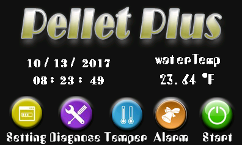
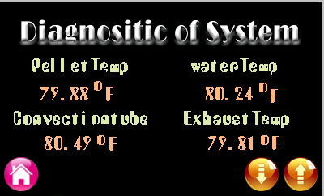
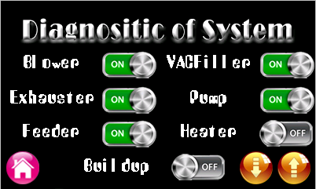
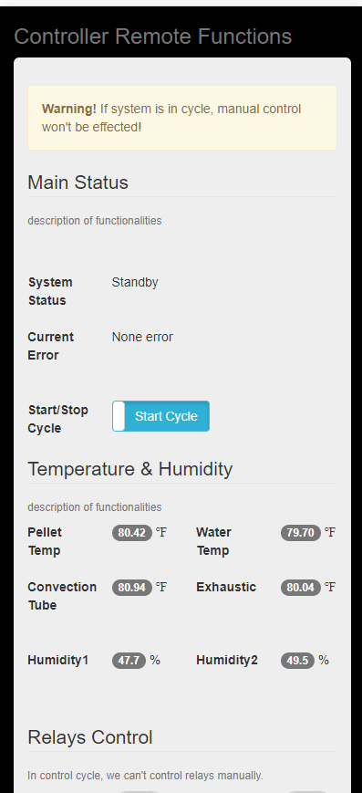
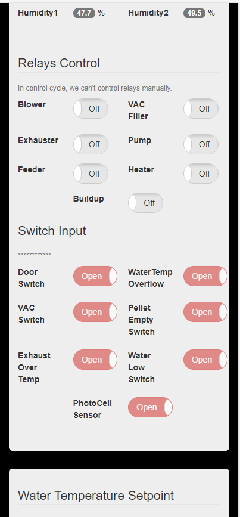
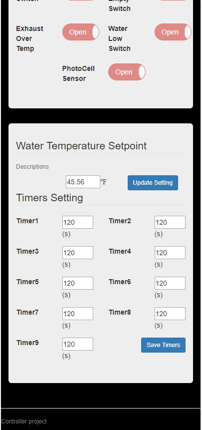

# esp32-pellet-hmi
 ESP32 + Nexton HMI for pellet machine

# Components
- ESP32 DevKit C
- Nextion HMI Extension 3.2"
- PCF8574 GPIO expanding module
- DS18B20 Temperature sensor(Industrial)
- DHT22 temperature sensor

# System Functions
- ESP32 Async Web server
- SPIFFS based bootstrap and sev
- Programamble control logic system using FSM & FBD
- None blocking DHT22 sensor library

# screenshots

# Wiring Diagram & Screenshots

